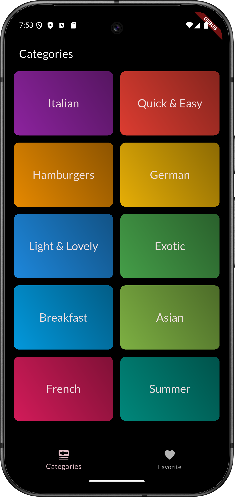
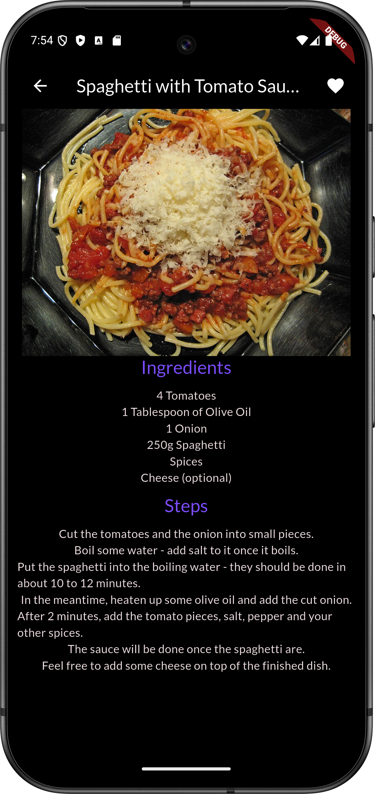

### 🍽️ Meals App Flutter

A Flutter application built to understand real-world Flutter app structure, focusing on navigation, data flow, and app-wide state management.

## 📌 Project Explanation (For Interviewers)

This project simulates a real food-browsing application and demonstrates how multiple screens communicate while sharing a common state.

The app starts with a TabScreen that manages two main sections:

 Categories – for browsing meals

Favorites – for accessing saved meals

From the Categories tab, the user navigates through:
Categories → Meals → Meal Details

A favorite toggle is implemented on the Meal Details screen.
When a meal is marked as favorite, the change is reflected instantly across all relevant screens (Meals list and Favorites tab).
This behavior is achieved using app-wide state management, ensuring a single source of truth for favorite meals.

The project focuses on data passing, state synchronization, and UI reuse, rather than only UI design.

## 🧭 App Flow
TabScreen
├── Categories → Meals → Meal Details
└── Favorites → Meal Details

## Screenshots

This Is Not The Final UI.The UI Will Change Every Time As Per The Current Market Standard
## 🧠 What This Project Demonstrates

Structured navigation using tabs and routes

Passing data between screens using constructors

Centralized state for managing favorites

Reusable widgets for meals and UI components

Separation of UI and logic

Understanding of Flutter’s widget tree and rebuilds

Features

Tab-based navigation (Categories & Favorites)

Category-wise meal browsing

Detailed meal view (ingredients & steps)

Add / remove meals from favorites

App-wide favorite state management

Technologies Used

Flutter

Dart

Material Design

## How to Run

# Clone the repository

git clone https://github.com/yourusername/meals_app_flutter.git

## Install dependencies

flutter pub get

## Run the app

flutter run
